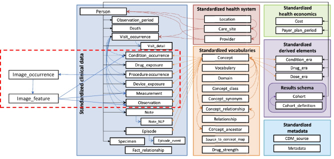
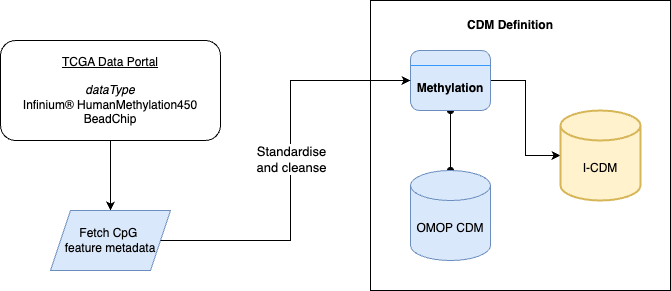

# Integrated Common Data Model (I-CDM)

The integrated common data model (i-CDM) is an extension to the [OMOP CDM v5.4](https://ohdsi.github.io/CommonDataModel/cdm54.html#Current_Support_for_CDM_v54).

For the DHR data pipeline scope, the model is defined based on the following;
1. EHR Data - OMOP CDM v5.4
2. Imaging - TCGA WSI Data
3. Methylation - TCGA Methylation data

## Combining Imaging Modality with OMOP CDM

Imaging entities were combined with OMOP CDM verbatim from an OHDSI [publication](https://www.ncbi.nlm.nih.gov/pmc/articles/PMC11031512/)

## Combining Methylation with OMOP CDM

For Methylation, the reference dataset was downloaded from TCGA and standardised based on the Common Data Model guidelines. Below is the workflow for integrating methylation into OMOP CDM

The complete definition can be viewed in the `./i_cdm_omop_v5.4` folder