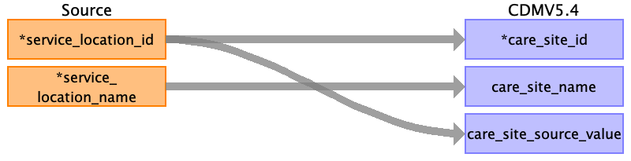

## Table name: care_site

### Reading from location.csv

| Destination Field | Source field | Logic | Comment field |
| --- | --- | --- | --- |
| care_site_id | service_location_id |  | service_location_id is is the unique identifier for the encounter place of service. If it is an integer it can be mapped to the care_site_id directly. If a string it has to be stored in care_site_source_value and then generated.  |
| care_site_name | service_location_name |  | service_location_name is the text description of the encounter place of service. This will directly provide the care_site_name.  |
| place_of_service_concept_id |  |  |  |
| location_id |  |  | This has to be auto generated for each of the care sites so that it can be linked to the location table and the location information can be mapped there. |
| care_site_source_value | service_location_id |  | The original service_location_id has to be stored in the care_site_source_value.  |
| place_of_service_source_value |  |  |  |

