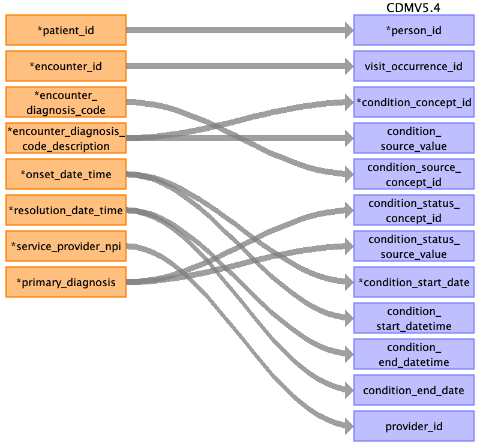
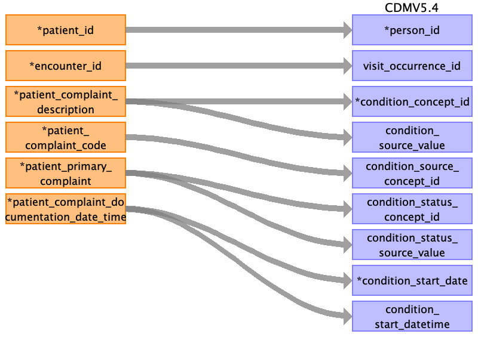

## Table name: condition_occurrence

### Reading from encounter_diagnosis.csv

| Destination Field | Source field | Logic | Comment field |
| --- | --- | --- | --- |
| condition_occurrence_id |  |  | This will be generated for each unique condition occurrence if not given in the source table. |
| person_id | patient_id |  | The patient_id is the primary key linking all tables. This can be mapped back to the the person_source_value/person_id of the person table depending on the logic used  |
| visit_occurrence_id | encounter_id |  | encounter_id is an identifier unique to the encounter. It is the primary key for the visit occurence table.  |
| condition_concept_id | encounter_diagnosis_code_description |  | encounter_diagnosis_code_description is the textual description of the encounter diagnosis codes. This can be used to derive the condition_concept_id. Alternatively, if the condition_source_concept_id is a part of the OMOP vocabulary that can be used for mapping.  |
| condition_source_value | encounter_diagnosis_code_description |  | encounter_diagnosis_code_description is the textual description of the encounter diagnosis codes. This can be directly stored in the condition_source_value.  |
| condition_source_concept_id | encounter_diagnosis_code |  | encounter_diagnosis_code includes the primary and additional diagnosis codes related to the encounter, represented as ICD10, SNOMED, or CT codes. This can be directly stored in condition_source_concept_id.  |
| condition_status_concept_id | primary_diagnosis |  | primary_diagnosis field states if the condition is the primary diagnosis. Based on the value it can be mapped to in condition_status_concept_id. This is data dependent, e.g. if only 'yes' and 'no' values are present then, 'yes' should map to concept id of 'primary diagnosis' whereas 'no' cannot be determined.  |
| condition_status_source_value | primary_diagnosis |  | primary_diagnosis field states if the condition is the primary diagnosis. It can be stored in condition_status_source_value. In case of 'yes' and 'no' values, 'primary_diagnosis: yes' or 'primary_diagnosis: no' would be more descriptive values for the field.  |
| condition_start_date | onset_date_time |  | onset_date_time is the date and time when the diagnosis was reported to begin or was first observed. The date element can be extracted and stored in condition_start_date. The standard format is not specified in the dictionary this has to be checked when we get the data.  |
| condition_start_datetime | onset_date_time |  | onset_date_time is the date and time when the diagnosis was reported to begin or was first observed. It can be stored in condition_start_datetime. The standard format is not specified in the dictionary this has to be checked when we get the data.  |
| condition_end_datetime | resolution_date_time |  | resolution_date_time is the date and time when the diagnosis was resolved. It can be stored in condition_end_datetime. The standard format is not specified in the dictionary this has to be checked when we get the data.  |
| condition_end_date | resolution_date_time |  | resolution_date_time is the date and time when the diagnosis was resolved. The date element can be extracted and stored in condition_end_date. The standard format is not specified in the dictionary this has to be checked when we get the data.  |
| provider_id | service_provider_npi |  | The service_provider_npi is the unique NPI for the clinician providing the encounter services. This will map to npi in provider table, the provider_id is the primary key for it which can be added to the condition occurrence table. In the source data if npi is not unique, care_site_id can act as an additional identifier, this will be corresponding to the service_location_id. provider_id is not given for the patient complaints at source, this could possibly mapped to the provider using a combination of the patient_is, encounter_id and service_location_id. |
| condition_type_concept_id |  |  | This has to be mapped to the respective Type Concept. Needs more investigation. |
| stop_reason |  |  |  |
| visit_detail_id |  |  |  |

### Reading from encounter_patient_complaint.csv

The encounter_patient_complaint table contains the complaints which are the patient’s description of their reason for seeking care. Though it can be alternatively mapped to observation, it was mapped to condition occurrence because the OMOP documentation clearly specifies that "This table contains records of Events of a Person suggesting the presence of a disease or medical condition stated as a diagnosis, a sign, or a symptom, which is either observed by a Provider or reported by the patient." Observation table was ruled out because OMOP states "If the clinical fact observed determines a sign, symptom, diagnosis of a disease or other medical condition, it is recorded in the CONDITION_OCCURRENCE table." However, it would be ideal for patient_complaint_documentation_date_time to have mapability to observation_datetime.

| Destination Field | Source field | Logic | Comment field |
| --- | --- | --- | --- |
| condition_occurrence_id |  |  | This will be generated for each unique condition occurrence if not given in the source table. |
| person_id | patient_id |  | The patient_id is the primary key linking all tables. This can be mapped back to the the person_source_value/person_id of the person table depending on the logic used.  |
| visit_occurrence_id | encounter_id |  | encounter_id is an identifier unique to the encounter. It is the primary key for the visit occurrence table.  |
| condition_concept_id | patient_complaint_description |  | patient_complaint_description is the text description of the complaints captured from patient encounter. It can be used to map the condition_concept_id. Alternatively, if the condition_source_concept_id follows OMOP accepted vocabulary it can be used for mapping.  |
| condition_source_value | patient_complaint_description |  | patient_complaint_description is the text description of the complaints captured from patient encounter. This can be directly stored in the condition_source_value.  |
| condition_source_concept_id | patient_complaint_code |  | patient_complaint_code is the standard code to document patient complaint. This can be directly stored in the condition_source_concept_id.  |
| condition_status_concept_id | patient_primary_complaint |  | patient_primary_complaint documents whether the complaint is the primary complaint of the patient from the primary encounter. Based on the value it can be mapped to in condition_status_concept_id. This is data dependent, e.g. if only 'yes' and 'no' values are present then, 'yes' should map to concept id corresponding to primary patient complaint (unsure from the given vocabulary) whereas 'no' cannot be determined.  |
| condition_status_source_value | patient_primary_complaint |  | patient_primary_complaint documents whether the complaint is the primary complaint of the patient from the primary encounter, this can be stored in condition_status_source_value. In case of 'yes' and 'no' values, 'patient_primary_complaint: yes' or 'patient_primary_complaint: no' would be more descriptive values for the field.  |
| condition_start_date | patient_complaint_documentation_date_time |  | This should ideally be the onset time of the disease/condition however the data/time given here is the time of documentation of the complaint, which may better fit in observation_datetime field of observation table. The intermapability of the same can be investigated.  As per OMOP ETL guidelines however, "Rather, if a source only has one date associated with a condition record it is acceptable to use that date for both the CONDITION_START_DATE and the CONDITION_END_DATE."  If it is the only date available, the date element from the patient_complaint_documentation_date_time can be extracted and stored in condition_start_date. The standard format is not specified in the dictionary this has to be checked when we get the data.  |
| condition_start_datetime | patient_complaint_documentation_date_time |  | This should ideally be the onset time of the disease/condition however the data/time given here is the time of documentation of the complaint, which may better fit in observation_datetime field of observation table. The intermapability of the same can be investigated.  As per OMOP ETL guidelines however, "Rather, if a source only has one date associated with a condition record it is acceptable to use that date for both the CONDITION_START_DATE and the CONDITION_END_DATE."  If it is the only date available, the patient_complaint_documentation_date_time can be stored in condition_start_datetime. The standard format is not specified in the dictionary this has to be checked when we get the data.  |
| condition_end_datetime |  |  |  |
| condition_end_date |  |  |  |
| provider_id |  |  | provider_id is not given for the patient complaints at source, this could possibly mapped to the provider using a combination of the patient_is, encounter_id and service_location_id. |
| condition_type_concept_id |  |  | This has to be mapped to the respective Type Concept. Needs more investigation. |
| stop_reason |  |  |  |
| visit_detail_id |  |  |  |

