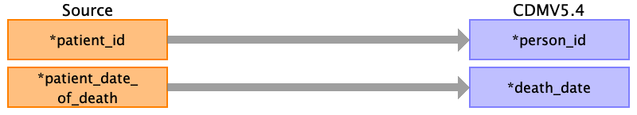

## Table name: death

### Reading from patient.csv

| Destination Field | Source field | Logic | Comment field |
| --- | --- | --- | --- |
| person_id | patient_id |  | The patient_id is the primary key linking all tables. This can be mapped back to the the person_source_value/person_id of the person table depending on the logic used.  |
| death_date | patient_date_of_death |  | The format of patient_date_of_death is not provided in the dictionary and has to be checked.  |
| death_datetime |  |  |  |
| death_type_concept_id |  |  |  |
| cause_concept_id |  |  |  |
| cause_source_value |  |  |  |
| cause_source_concept_id |  |  |  |

