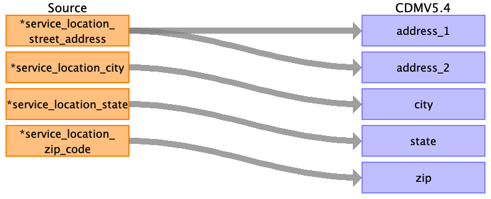

## Table name: location

### Reading from location.csv

| Destination Field | Source field | Logic | Comment field |
| --- | --- | --- | --- |
| location_id |  |  | This information has to be mapped from the care_site table. The service_location_id will act as care_site_source_value/care_site_id. If not provided this has to be autogenerated. |
| address_1 | service_location_street_address |  | service_location_street_address contains the street address of the service location where services were provided. The first line of address will be stored in address_1  |
| address_2 | service_location_street_address |  | service_location_street_address contains the street address of the service location where services were provided. The second line of address will be stored in address_2  |
| city | service_location_city |  | service_location_city is the city of the service location where services were provided. This can be directly stored in city.  |
| state | service_location_state |  | service_location_state is the state of the service location where services were provided. This can be directly stored in state.  |
| zip | service_location_zip_code |  | service_location_zip_code is the zip code of the service location where services were provided. This can be directly stored in zip.  |
| county |  |  |  |
| location_source_value |  |  |  |
| country_concept_id |  |  |  |
| country_source_value |  |  |  |
| latitude |  |  |  |
| longitude |  |  |  |

