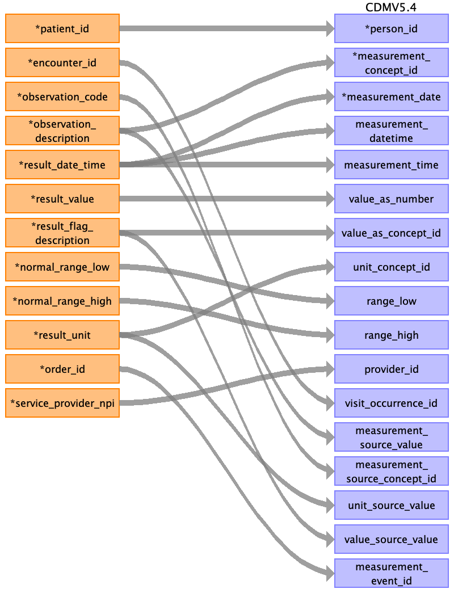

## Table name: measurement

### Reading from result_observation.csv

| Destination Field | Source field | Logic | Comment field |
| --- | --- | --- | --- |
| measurement_id |  |  | This will be generated for each unique result of observatio/measurement if not given in the source table. |
| person_id | patient_id |  | The patient_id is the primary key linking all tables. This can be mapped back to the the person_source_value/person_id of the person table depending on the logic used  |
| measurement_concept_id | observation_description |  | The observation_description is the text description for Observation Code. This can used to derive the measurement_concept_id. Alternatively, if measurement_source_concept_id is a part of the OMOP vocabulary that can be used for mapping.  |
| measurement_date | result_date_time |  | result_date_time is the date and time of the result/observation. The ETL convention specifies "If there are multiple dates in the source data associated with a record such as order_date, draw_date, and result_date, choose the one that is closest to the date the sample was drawn from the patient." Hence even though the date represents the result date it is the closest match for the measurement_date field. Date can be extracted from date time value. The standard format is not specified in the dictionary this has to be checked when we get the data.  |
| measurement_datetime | result_date_time |  | result_date_time can be stored directly in measurement_datetime. The standard format is not specified in the dictionary this has to be checked when we get the data.  |
| measurement_time | result_date_time |  | measurement_time can be extracted from result_date_time. The standard format is not specified in the dictionary this has to be checked when we get the data  |
| measurement_type_concept_id |  |  | This has to be mapped to the respective Type Concept. Needs more investigation. |
| operator_concept_id |  |  |  |
| value_as_number | result_value |  | result_value is the documented value/result. It can be stored in value_as_number as the data type here seems to be float/integer. In case not a numeric value, this might need investigation.  |
| value_as_concept_id | result_flag_description |  | result_flag_description is the text description of the Result Flag. As it is a description field it can be used to derive the value_as_concept_id.  |
| unit_concept_id | result_unit |  | The result unit can be used to map the unit_concept_id.  |
| range_low | normal_range_low |  | Lower limit of normal result range, can be directly stored as range_low. It should have same unit as value_as_number.  |
| range_high | normal_range_high |  | Upper limit of normal result range, can be directly stored as range_high. It should have same unit as value_as_number.  |
| provider_id | service_provider_npi |  | The service_provider_npi is the unique NPI for the clinician providing the encounter services. This will map to npi in provider table, the provider_id is the primary key for it which can be added to the measurement table.  |
| visit_occurrence_id | encounter_id |  | encounter_id is an identifier unique to the encounter. It is the primary key for the visit occurrence table. This can be mapped back to the the visit_source_value/visit_occurrence_id of the person table depending on the logic used.  |
| visit_detail_id |  |  |  |
| measurement_source_value | observation_description |  | It is the text description for the observation Code. This can be stored directly as measurement_source_value.  |
| measurement_source_concept_id | observation_code |  | It is the standard code that describe the observations of the results of laboratory orders, imaging procedures, and other studies. This can be directly mapped to measurement_source_concept_id.  |
| unit_source_value | result_unit |  | The result unit can be directly stored as the unit_source_value.  |
| unit_source_concept_id |  |  |  |
| value_source_value | result_flag_description |  | result_flag_description is the text description of the Result Flag. As per ETL specification the field being used to generate the value_as_concept_id should be stored in the value_source_value. value_source_value will always contain the field that is being used to generate the value_as_concept_id |
| measurement_event_id | order_id |  | At source this order_id along with patient_id and encounter_id will be the keys for the Orders table, and hence a relationship is established. As per the OMOP guide "If the Measurement record is related to another record in the database, this field is the primary key of the linked record". Hence as there is no other field, this can be used to directly map to the target table for the "Orders" table from ACEP. (most likely the procedure_occurrence table on OMOP, hence this should contain corresponding procedure_id)  |
| meas_event_field_concept_id |  |  | It should record the concept_id for the table whose primary_key is being added to measurement_event_id (most likely procedure_occurrence table in this case) |

