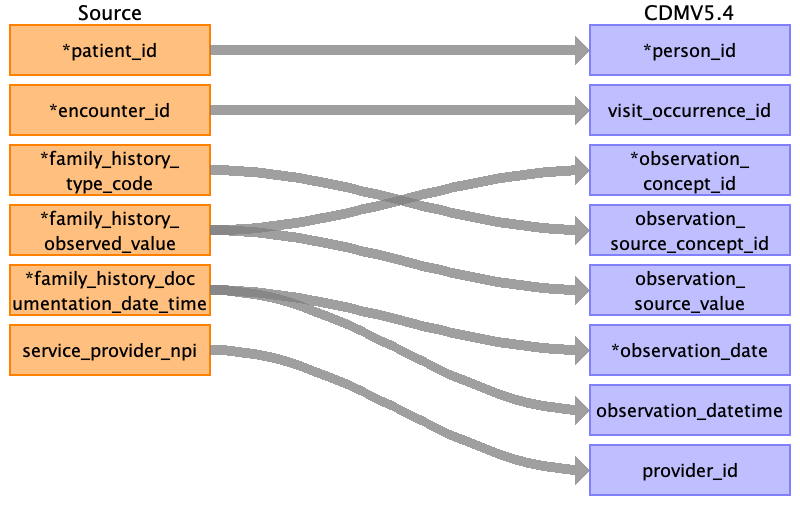
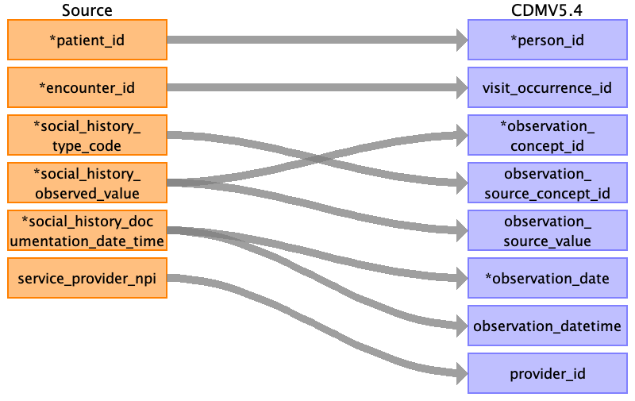

## Table name: observation

### Reading from family_history.csv

| Destination Field | Source field | Logic | Comment field |
| --- | --- | --- | --- |
| observation_id |  |  | This will be generated for each unique observation if not given in the source table. |
| person_id | patient_id |  | The patient_id is the primary key linking all tables. This can be mapped back to the the person_source_value/person_id of the person table depending on the logic used  |
| visit_occurrence_id | encounter_id |  | encounter_id is an identifier unique to the encounter. It is the primary key for the visit occurence table. This can be mapped back to the the visit_source_value/visit_occurrence_id of the person table depending on the logic used.  |
| observation_type_concept_id |  |  | This has to be mapped to the respective Type Concept. Needs more investigation. |
| observation_concept_id | family_history_observed_value |  | family_history_observed_value is the unstructured/non-standard family history documentation. This can used to derive the observation_concept_id. Alternatively, if the observation_source_concept_id is a part of the OMOP vocabulary that can be used for mapping.  |
| observation_source_concept_id | family_history_type_code |  | family_history_type_code has SNOMED CT code representing family medical history hierarchy. This can be directly mapped to observation_source_concept_id.  |
| observation_source_value | family_history_observed_value |  | family_history_observed_value is the unstructured/non-standard family history documentation. This can be stored directly as observation_source_value.  |
| observation_date | family_history_documentation_date_time |  | family_history_documentation_date_time is the date and time when the family history is recorded. The date element can be extracted and stored in observation_date. The standard format is not specified in the dictionary this has to be checked when we get the data.  |
| observation_datetime | family_history_documentation_date_time |  | family_history_documentation_date_time is the date and time when the family history is recorded. This can be stored in observation_datetime. The standard format is not specified in the dictionary this has to be checked when we get the data. |
| provider_id | service_provider_npi |  | The service_provider_npi is the unique NPI for the clinician providing the encounter services. This will map to npi in provider table, the provider_id is the primary key for it which can be added to the observation table.  |
| value_as_string |  |  |  |
| value_as_number |  |  |  |
| value_as_concept_id |  |  |  |
| qualifier_concept_id |  |  |  |
| unit_concept_id |  |  |  |
| visit_detail_id |  |  |  |
| unit_source_value |  |  |  |
| qualifier_source_value |  |  |  |
| value_source_value |  |  |  |
| observation_event_id |  |  |  |
| obs_event_field_concept_id |  |  |  |

### Reading from social_history.csv

| Destination Field | Source field | Logic | Comment field |
| --- | --- | --- | --- |
| observation_id |  |  | This will be generated for each unique observation if not given in the source table. |
| person_id | patient_id |  | The patient_id is the primary key linking all tables. This can be mapped back to the the person_source_value/person_id of the person table depending on the logic used  |
| visit_occurrence_id | encounter_id |  | encounter_id is an identifier unique to the encounter. It is the primary key for the visit occurence table. This can be mapped back to the the visit_source_value/visit_occurrence_id of the person table depending on the logic used.  |
| observation_type_concept_id |  |  | This has to be mapped to the respective Type Concept. Needs more investigation. |
| observation_concept_id | social_history_observed_value |  | social_history_observed_value is the unstructured/non-standard social history documentation. This can used to derive the observation_concept_id. Alternatively, if the observation_source_concept_id is a part of the OMOP vocabulary that can be used for mapping.  |
| observation_source_concept_id | social_history_type_code |  | social_history_type_code has standard code representing social history. This can be directly mapped to observation_source_concept_id.  |
| observation_source_value | social_history_observed_value |  | social_history_observed_value is the unstructured/non-standard social history documentation. This can be stored directly as observation_source_value.  |
| observation_date | social_history_documentation_date_time |  | social_history_documentation_date_time is the date and time when the social history is recorded. The date element can be extracted and stored in observation_date. The standard format is not specified in the dictionary this has to be checked when we get the data.  |
| observation_datetime | social_history_documentation_date_time |  | social_history_documentation_date_time is the date and time when the social history is recorded. This can be stored in observation_datetime. The standard format is not specified in the dictionary this has to be checked when we get the data. family_history_documentation_date_time is the date and time when the family history is recorded. This can be stored in observation_datetime. The standard format is not specified in the dictionary this has to be checked when we get the data. |
| provider_id | service_provider_npi |  | The service_provider_npi is the unique NPI for the clinician providing the encounter services. This will map to npi in provider table, the provider_id is the primary key for it which can be added to the observation table.  |
| value_as_string |  |  |  |
| value_as_number |  |  |  |
| value_as_concept_id |  |  |  |
| qualifier_concept_id |  |  |  |
| unit_concept_id |  |  |  |
| visit_detail_id |  |  |  |
| unit_source_value |  |  |  |
| qualifier_source_value |  |  |  |
| value_source_value |  |  |  |
| observation_event_id |  |  |  |
| obs_event_field_concept_id |  |  |  |

