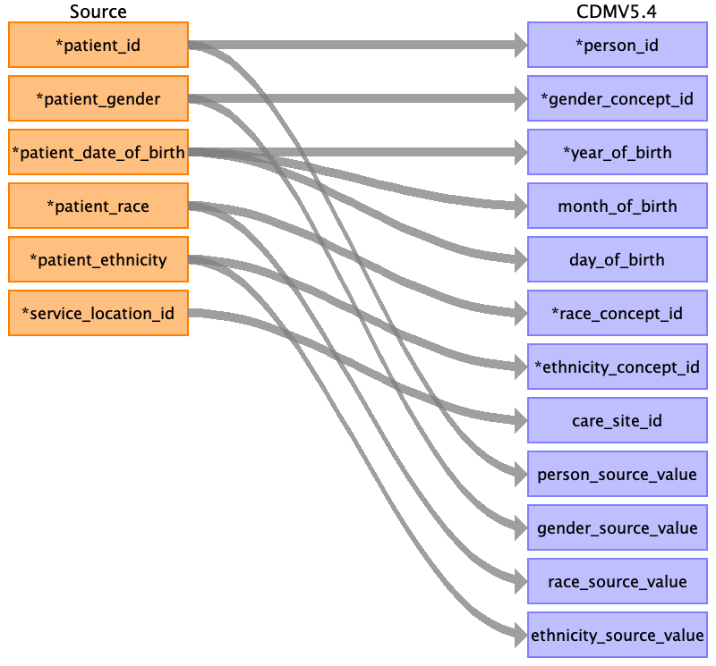

## Table name: person

### Reading from patient.csv

| Destination Field | Source field | Logic | Comment field |
| --- | --- | --- | --- |
| person_id | patient_id |  | If all the patient_id are integers then it could directly be used as a person_id, but if they are strings, the patient_id would go to person_source_value and the person_id will have to be generated.  |
| gender_concept_id | patient_gender |  | The gender_concept_id would have to be mapped from the concept table. The description to be mapped would be coming from patient_gender/gender_source_value. This logic can be derived once we have the data.  |
| year_of_birth | patient_date_of_birth |  | year_of_birth will be extracted from patient_date_of_birth which is represented as yyyy-mm-dd  |
| month_of_birth | patient_date_of_birth |  | month_of_birth will be extracted from patient_date_of_birth which is represented as yyyy-mm-dd  |
| day_of_birth | patient_date_of_birth |  | day_of_birth will be extracted from patient_date_of_birth which is represented as yyyy-mm-dd  |
| birth_datetime |  |  |  |
| race_concept_id | patient_race |  | The race_concept_id would have to be mapped from the concept table. The description to be mapped would be coming from patient_race/race_source_value. This logic can be derived once we have the data.  |
| ethnicity_concept_id | patient_ethnicity |  | The ethnicity_concept_id would have to be mapped from the concept table. The description to be mapped would be coming from patient_ethnicity/ethnicity_source_value. This logic can be derived once we have the data.  |
| location_id |  |  |  |
| provider_id |  |  |  |
| care_site_id | service_location_id |  | service_location_id is is the unique identifier for the encounter place of service.It has to be mapped to the care_site_source_value/care_site_id in care_site_table.  |
| person_source_value | patient_id |  | The original patient_id from the source would go to person_source_value.  |
| gender_source_value | patient_gender |  | The patient_gender can be directly stored in gender_source_value  |
| gender_source_concept_id |  |  |  |
| race_source_value | patient_race |  | The patient_race can be directly stored in race_source_value  |
| race_source_concept_id |  |  |  |
| ethnicity_source_value | patient_ethnicity |  | The patient_ethnicity can be directly stored in ethnicity_source_value  |
| ethnicity_source_concept_id |  |  |  |

