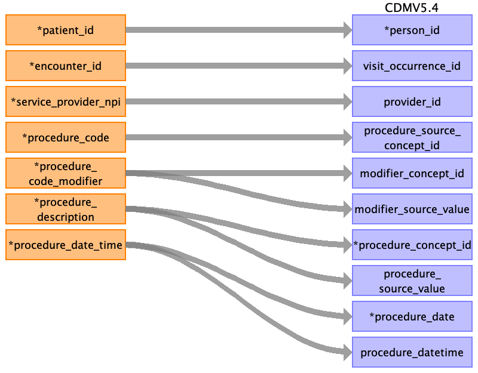

## Table name: procedure_occurrence

### Reading from encounter_procedure.csv

| Destination Field | Source field | Logic | Comment field |
| --- | --- | --- | --- |
| procedure_occurrence_id |  |  | This will be generated for each unique procedure if not given in the source table. |
| person_id | patient_id |  | The patient_id is the primary key linking all tables. This can be mapped back to the the person_source_value/person_id of the person table depending on the logic used.  |
| visit_occurrence_id | encounter_id |  | encounter_id is an identifier unique to the encounter. It is the primary key for the visit occurence table.  |
| provider_id | service_provider_npi |  | The service_provider_npi is the unique NPI for the clinician providing the encounter services. This will map to npi in provider table, the provider_id is the primary key for it which can be added to the observation table. In the source data if npi is not unique, care_site_id can act as an additional identifier, this will be corresponding to the service_location_id.  |
| procedure_source_concept_id | procedure_code |  | procedure_code represents the standard code for the procedure followed and can be directly mapped to procedure_source_concept_id.  |
| modifier_concept_id | procedure_code_modifier |  | procedure_code_modifier contains any additional modifiers to the standard code for the procedure followed and can be used to derive the modifier_concept_id.  |
| modifier_source_value | procedure_code_modifier |  | procedure_code_modifier contains any additional modifiers to the standard code for the procedure followed and can be directly mapped to modifier_source_value.  |
| procedure_concept_id | procedure_description |  | procedure_description has the textual description for the procedure followed. It can be used to derive the procedure_concept_id. Alternatively, if the procedure_source_concept_id follows OMOP accepted standard vocabulary, it can be used for the mapping.  |
| procedure_source_value | procedure_description |  | procedure_description has the textual description for the procedure followed. It can be stored as procedure_source_value.  |
| procedure_date | procedure_date_time |  | procedure_date_time is the date and time for the procedure. The date element can be extracted and stored in procedure_date. The standard format is not specified in the dictionary this has to be checked when we get the data.  |
| procedure_datetime | procedure_date_time |  | procedure_date_time is the date and time for the procedure and can stored in procedure_datetime. The standard format is not specified in the dictionary this has to be checked when we get the data.  |
| procedure_end_date |  |  |  |
| procedure_end_datetime |  |  |  |
| procedure_type_concept_id |  |  | This has to be mapped to the respective Type Concept. Needs more investigation. |
| quantity |  |  |  |
| visit_detail_id |  |  |  |

