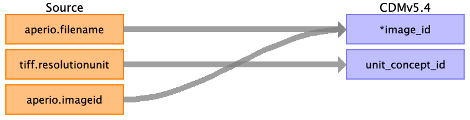

## Table name: image_feature

### Reading from svs_metadata.csv

| Destination Field | Source field | Logic | Comment field |
| --- | --- | --- | --- |
| feature_id |  |  |  |
| image_id | aperio.filename aperio.imageid |  |  |
| feature_type |  |  |  |
| feature_value |  |  |  |
| unit_concept_id | tiff.resolutionunit |  |  |
| extraction_method |  |  |  |
| date_of_extraction |  |  |  |

