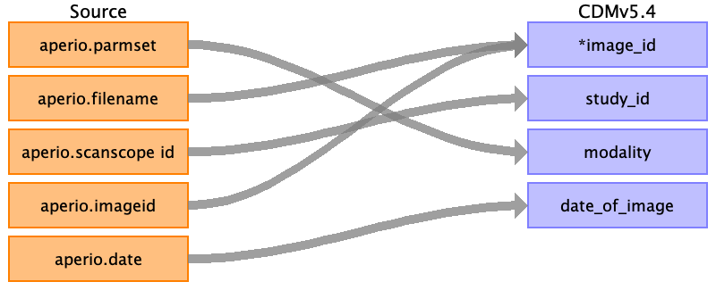

## Table name: image_occurrence

### Reading from svs_metadata.csv

| Destination Field | Source field | Logic | Comment field |
| --- | --- | --- | --- |
| image_id | aperio.filename aperio.imageid |  | As per source metadata file, aperio.Filename and aperio.ImageID have identical values and correspond to the unique image identifier. As per source metadata file, aperio.Filename and aperio.ImageID have identical values and correspond to the unique image identifier.  |
| person_id |  |  |  |
| study_id | aperio.scanscope id |  | Since the ScanScope ID uniquely identifies each scanned slide, it can serve as a reference for image_occurrence.  |
| modality | aperio.parmset |  | This source field mentions that the parameters were set for the modality IHC for one of the images in the field aperio.Parmset. Note- this field is not populated for all images.  |
| body_part_examined |  |  |  |
| date_of_image | aperio.date |  | Source field (aperio.Date)provides the date of the imaging study in date format.  |
| file_location |  |  |  |

