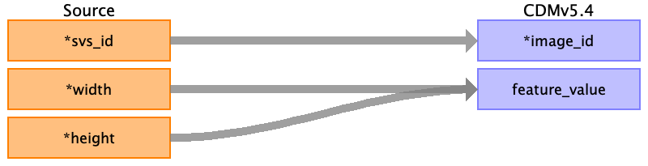
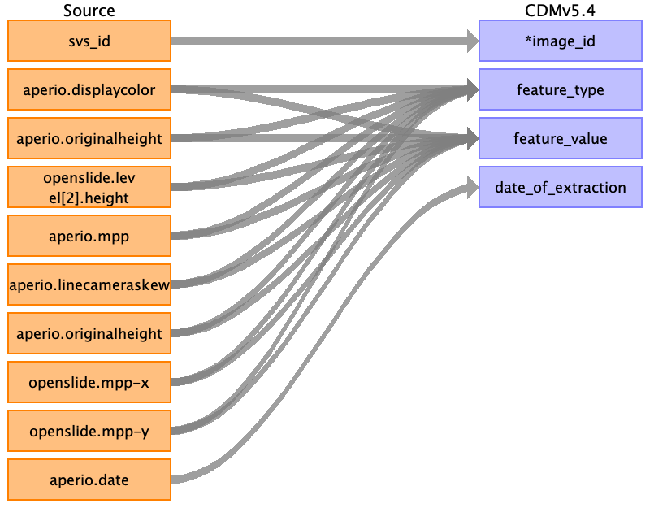
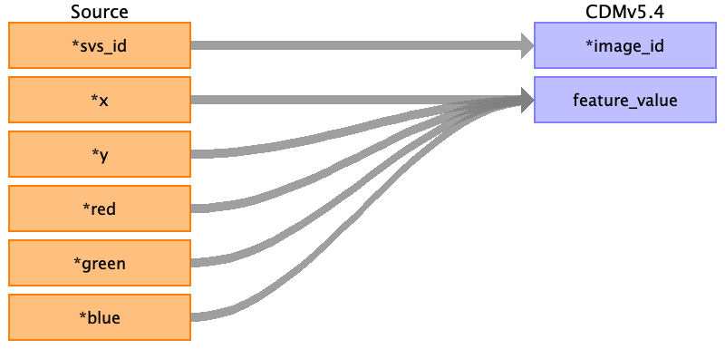

## Table name: image_feature

### Reading from svs_image_data.csv

| Destination Field | Source field | Logic | Comment field |
| --- | --- | --- | --- |
| feature_id |  |  |  |
| image_id | svs_id |  | svs_id is the common link between the 3 files and they are all about image ,so svs_id can be treated as image_id  |
| feature_type |  |  |  |
| feature_value | width height |  | Width can be considered a feature value since it represents the specific measurement for certain characteristics of the image. height can be considered a feature value since it represents the specific measurement for certain characteristics of the image.  |
| unit_concept_id |  |  |  |
| extraction_method |  |  |  |
| date_of_extraction |  |  |  |

### Reading from svs_metadata.csv

| Destination Field | Source field | Logic | Comment field |
| --- | --- | --- | --- |
| feature_id |  |  |  |
| image_id | svs_id |  | svs_id is the common link between the 3 files and they are all about image ,so svs_id can be treated as image_id  |
| feature_type | aperio.displaycolor aperio.originalheight openslide.level[2].height aperio.originalheight openslide.mpp-y openslide.mpp-x aperio.linecameraskew aperio.mpp |  | display color represents feature type of image , hence mapping it to feature_type height represents feature type of image , hence mapping it to feature_type height represents feature type of image , hence mapping it to feature_type height represents feature type of image , hence mapping it to feature_type MPP represents the Microns Per Pixel, a common measure of image resolution , which is a image feature , hence mapping it to feature_type MPP represents the Microns Per Pixel, a common measure of image resolution , which is a image feature , hence mapping it to feature_type aperio.LineCameraSkew is a technical feature related to image acquisition quality. It provides useful information about potential distortions in the image due to camera misalignment and this is treated as image feature for correction purpose , hence mapping it to feature_type MPP represents the Microns Per Pixel, a common measure of image resolution , which is a image feature , hence mapping it to feature_type  |
| feature_value | aperio.displaycolor aperio.originalheight openslide.level[2].height aperio.originalheight openslide.mpp-y openslide.mpp-x aperio.linecameraskew aperio.mpp |  | display color represents feature value of image , hence mapping it to feature_value height represents feature value of image , hence mapping it to feature_value height represents feature value of image , hence mapping it to feature_value height represents feature value of image , hence mapping it to feature_value MPP represents the Microns Per Pixel, a common measure of image resolution , which is a image feature , hence mapping it to feature_value MPP represents the Microns Per Pixel, a common measure of image resolution , which is a image feature , hence mapping it to feature_value aperio.LineCameraSkew is a technical feature related to image acquisition quality. It provides useful information about potential distortions in the image due to camera misalignment and this is treated as image feature for correction purpose , hence mapping it to feature_value MPP represents the Microns Per Pixel, a common measure of image resolution , which is a image feature , hence mapping it to feature_value  |
| unit_concept_id |  |  |  |
| extraction_method |  |  |  |
| date_of_extraction | aperio.date |  | Aperio.data represents the date and time of image acquisition or creation , so that can be treated as date_of_extraction.  |

### Reading from svs_thumbnail.csv

| Destination Field | Source field | Logic | Comment field |
| --- | --- | --- | --- |
| feature_id |  |  |  |
| image_id | svs_id |  | svs_id is the common link between the 3 files and they are all about image ,so svs_id can be treated as image_id  |
| feature_type |  |  |  |
| feature_value | x y red green blue |  | X represents the coordinates of image and can be treated as feature_value Y represents the coordinates of image and can be treated as feature_value RED represents the intensity of red colour in image and can be treated as feature_value green represents the intensity of green colour in image and can be treated as feature_value blue represents the intensity of blue colour in image and can be treated as feature_value  |
| unit_concept_id |  |  |  |
| extraction_method |  |  |  |
| date_of_extraction |  |  |  |

