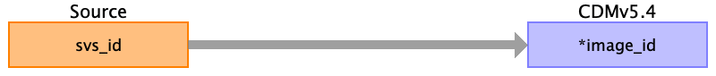

## Table name: image_occurrence

### Reading from svs_metadata.csv

| Destination Field | Source field | Logic | Comment field |
| --- | --- | --- | --- |
| image_id | svs_id |  | svs_id is the common link between the 3 files and they are all about image ,so svs_id can be treated as image_id  |
| person_id |  |  |  |
| study_id |  |  |  |
| modality |  |  |  |
| body_part_examined |  |  |  |
| date_of_image |  |  |  |
| file_location |  |  |  |

