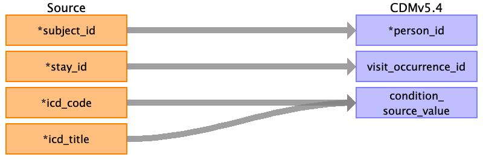

## Table name: condition_occurrence

### Reading from diagnosis.csv

| Destination Field | Source field | Logic | Comment field |
| --- | --- | --- | --- |
| condition_occurrence_id |  |  |  |
| person_id | subject_id |  |  |
| condition_concept_id |  |  |  |
| condition_start_date |  |  |  |
| condition_start_datetime |  |  |  |
| condition_end_date |  |  |  |
| condition_end_datetime |  |  |  |
| condition_type_concept_id |  |  |  |
| condition_status_concept_id |  |  |  |
| stop_reason |  |  |  |
| provider_id |  |  |  |
| visit_occurrence_id | stay_id |  |  |
| visit_detail_id |  |  |  |
| condition_source_value | icd_code icd_title | Ideally, we shoudl add a custom field to your condition_occurrence table to store the icd_title. This will allow us to preserve the original text description for future reference or analysis. We can reuse condition_source_value to store the icd_title as well. However, this might make it less clear that the value represents the ICD code description. |  |
| condition_source_concept_id |  |  |  |
| condition_status_source_value |  |  |  |

