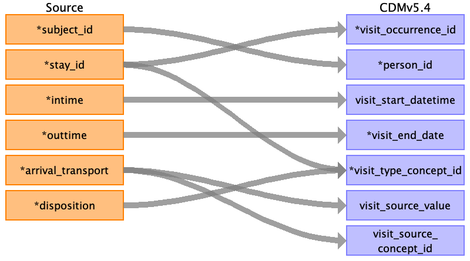
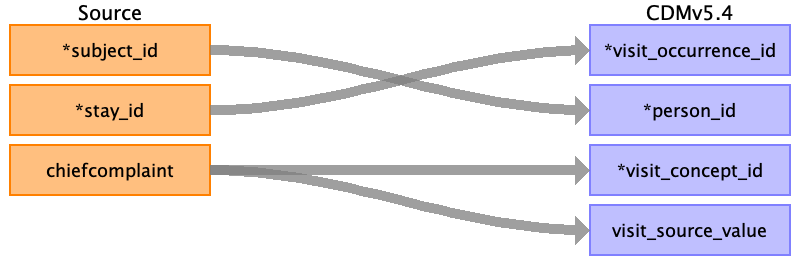

## Table name: visit_occurrence

### Reading from edstays.csv

| Destination Field | Source field | Logic | Comment field |
| --- | --- | --- | --- |
| visit_occurrence_id | stay_id |  |  |
| person_id | subject_id |  |  |
| visit_concept_id |  |  |  |
| visit_start_date |  |  |  |
| visit_start_datetime | intime |  |  |
| visit_end_date | outtime |  |  |
| visit_end_datetime |  |  |  |
| visit_type_concept_id | stay_id disposition | Consider using a visit_type_concept_id to indicate that the visit is an emergency department visit. These concepts should represent the outcome of the emergency department visit. Ex: If the arrival_transport is "AMBULANCE" and the disposition is "ADMITTED," the visit_occurrence table might look like: visit_occurrence_id	person_id	visit_start_datetime	visit_end_datetime	visit_source_concept_id	visit_type_concept_id  12345	67890	2023-01-01 10:00:00	2023-01-01 12:00:00	38004353	38004308 |  |
| provider_id |  |  |  |
| care_site_id |  |  |  |
| visit_source_value | arrival_transport |  |  |
| visit_source_concept_id | arrival_transport | This field in the OMOP CDM is designed to capture the source of the visit, which in this case is the mode of transportation used to arrive at the emergency department. While arrival_transport could potentially be mapped to visit_concept_id as it considered a type of visit, it's more accurately represented as a source of the visit. |  |
| admitted_from_concept_id |  |  |  |
| admitted_from_source_value |  |  |  |
| discharged_to_concept_id |  |  |  |
| discharged_to_source_value |  |  |  |
| preceding_visit_occurrence_id |  |  |  |

### Reading from triage.csv

| Destination Field | Source field | Logic | Comment field |
| --- | --- | --- | --- |
| visit_occurrence_id | stay_id |  |  |
| person_id | subject_id |  |  |
| visit_concept_id | chiefcomplaint | If the chiefcomplaint is "chest pain" and the patient was brought to the ED by ambulance, you might assign the visit_concept_id of "38004353" (Ambulance) to the visit_occurrence table. |  |
| visit_start_date |  |  |  |
| visit_start_datetime |  |  |  |
| visit_end_date |  |  |  |
| visit_end_datetime |  |  |  |
| visit_type_concept_id |  |  |  |
| provider_id |  |  |  |
| care_site_id |  |  |  |
| visit_source_value | chiefcomplaint | The chiefcomplaint field in the triage table typically contains a free-text description of the patient's reported reason for visiting the emergency department. If no matching standardized concept is found, map the chiefcomplaint to visit_source_value in the visit_occurrence table. |  |
| visit_source_concept_id |  |  |  |
| admitted_from_concept_id |  |  |  |
| admitted_from_source_value |  |  |  |
| discharged_to_concept_id |  |  |  |
| discharged_to_source_value |  |  |  |
| preceding_visit_occurrence_id |  |  |  |

