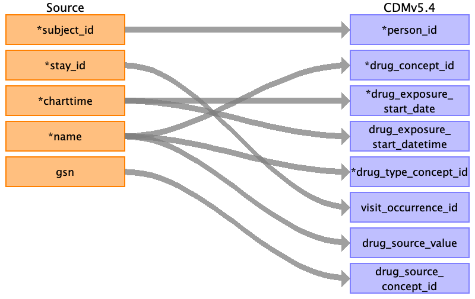

## Table name: drug_exposure

### Reading from medrecon.csv

| Destination Field | Source field | Logic | Comment field |
| --- | --- | --- | --- |
| drug_exposure_id |  |  |  |
| person_id | subject_id |  |  |
| drug_concept_id | name |  |  |
| drug_exposure_start_date | charttime |  |  |
| drug_exposure_start_datetime | charttime |  |  |
| drug_exposure_end_date |  |  |  |
| drug_exposure_end_datetime |  |  |  |
| verbatim_end_date |  |  |  |
| drug_type_concept_id | name | drug_type_concept_id = 32830    Type = EHR medication list  Vocab = OMOP |  |
| stop_reason |  |  |  |
| refills |  |  |  |
| quantity |  |  |  |
| days_supply |  |  |  |
| sig |  |  |  |
| route_concept_id |  |  |  |
| lot_number |  |  |  |
| provider_id |  |  |  |
| visit_occurrence_id | stay_id |  |  |
| visit_detail_id |  |  |  |
| drug_source_value | name |  |  |
| drug_source_concept_id | gsn |  |  |
| route_source_value |  |  |  |
| dose_unit_source_value |  |  |  |

### Reading from pyxis.csv

| Destination Field | Source field | Logic | Comment field |
| --- | --- | --- | --- |
| drug_exposure_id |  |  |  |
| person_id | subject_id |  |  |
| drug_concept_id | name |  | 0  |
| drug_exposure_start_date | charttime |  |  |
| drug_exposure_start_datetime | charttime |  |  |
| drug_exposure_end_date |  |  |  |
| drug_exposure_end_datetime |  |  |  |
| verbatim_end_date |  |  |  |
| drug_type_concept_id | name | drug_type_concept_id = 32825    Type = EHR dispensing record  Vocab = OMOP |  |
| stop_reason |  |  |  |
| refills |  |  |  |
| quantity |  |  |  |
| days_supply |  |  |  |
| sig |  |  |  |
| route_concept_id |  |  |  |
| lot_number |  |  |  |
| provider_id |  |  |  |
| visit_occurrence_id | stay_id |  |  |
| visit_detail_id |  |  |  |
| drug_source_value | name |  |  |
| drug_source_concept_id | gsn |  |  |
| route_source_value |  |  |  |
| dose_unit_source_value |  |  |  |

