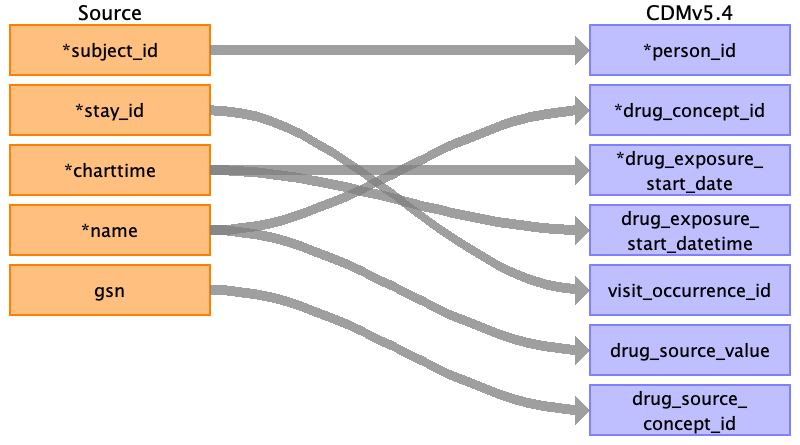
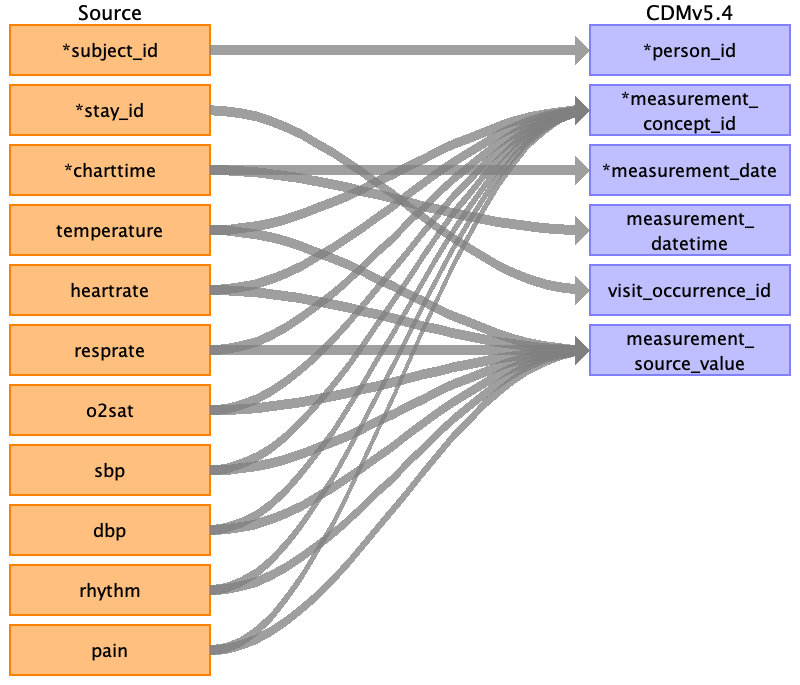

## Table name: measurement

### Reading from triage.csv

| Destination Field | Source field | Logic | Comment field |
| --- | --- | --- | --- |
| measurement_id |  |  |  |
| person_id | subject_id |  |  |
| measurement_concept_id | temperature heartrate resprate o2sat sbp dbp pain |  |  |
| measurement_date |  |  |  |
| measurement_datetime |  |  |  |
| measurement_time |  |  |  |
| measurement_type_concept_id |  |  |  |
| operator_concept_id |  |  |  |
| value_as_number |  |  |  |
| value_as_concept_id | chiefcomplaint |  |  |
| unit_concept_id |  |  |  |
| range_low |  |  |  |
| range_high |  |  |  |
| provider_id |  |  |  |
| visit_occurrence_id | stay_id |  |  |
| visit_detail_id |  |  |  |
| measurement_source_value | temperature heartrate resprate o2sat sbp dbp pain | For each triage value create a new column in the OMOP CDM table with the suffix _source_value. For example: triage_temperature_source_value.  Directly populate these new columns with the corresponding values from the triage table. For each triage value create a new column in the OMOP CDM table with the suffix _source_value. For example: triage_heartrate_source_value.  Directly populate these new columns with the corresponding values from the triage table. For each triage value create a new column in the OMOP CDM table with the suffix _source_value. For example: triage_resprate_source_value.  Directly populate these new columns with the corresponding values from the triage table. For each triage value create a new column in the OMOP CDM table with the suffix _source_value. For example: triage_o2sat_source_value.  Directly populate these new columns with the corresponding values from the triage table. For each triage value create a new column in the OMOP CDM table with the suffix _source_value. For example: triage_sbp_source_value.  Directly populate these new columns with the corresponding values from the triage table. For each triage value create a new column in the OMOP CDM table with the suffix _source_value. For example: triage_dbp_source_value.  Directly populate these new columns with the corresponding values from the triage table. For each triage value create a new column in the OMOP CDM table with the suffix _source_value. For example: triage_pain_source_value.  Directly populate these new columns with the corresponding values from the triage table. |  |
| measurement_source_concept_id |  |  |  |
| unit_source_value |  |  |  |
| unit_source_concept_id |  |  |  |
| value_source_value | chiefcomplaint acuity |  |  |
| measurement_event_id |  |  |  |
| meas_event_field_concept_id |  |  |  |

### Reading from vitalsign.csv

| Destination Field | Source field | Logic | Comment field |
| --- | --- | --- | --- |
| measurement_id |  |  |  |
| person_id | subject_id |  |  |
| measurement_concept_id | temperature heartrate resprate o2sat sbp dbp pain rhythm |  |  |
| measurement_date | charttime |  |  |
| measurement_datetime | charttime |  |  |
| measurement_time |  |  |  |
| measurement_type_concept_id |  |  |  |
| operator_concept_id |  |  |  |
| value_as_number |  |  |  |
| value_as_concept_id |  |  |  |
| unit_concept_id |  |  |  |
| range_low |  |  |  |
| range_high |  |  |  |
| provider_id |  |  |  |
| visit_occurrence_id | stay_id |  |  |
| visit_detail_id |  |  |  |
| measurement_source_value | temperature heartrate resprate o2sat sbp dbp rhythm pain | For each vital sign create a new column in the OMOP CDM table with the suffix _source_value. For example: temperature_source_value.  Directly populate these new columns with the corresponding values from the vitalsign table. This preserves the original, unstandardized values. For each vital sign create a new column in the OMOP CDM table with the suffix _source_value. For example: heartrate_source_value.  Directly populate these new columns with the corresponding values from the vitalsign table. This preserves the original, unstandardized values. For each vital sign create a new column in the OMOP CDM table with the suffix _source_value. For example: resprate_source_value.  Directly populate these new columns with the corresponding values from the vitalsign table. This preserves the original, unstandardized values. For each vital sign create a new column in the OMOP CDM table with the suffix _source_value. For example: o2sat_source_value.  Directly populate these new columns with the corresponding values from the vitalsign table. This preserves the original, unstandardized values. For each vital sign create a new column in the OMOP CDM table with the suffix _source_value. For example: sbp_source_value.  Directly populate these new columns with the corresponding values from the vitalsign table. This preserves the original, unstandardized values. For each vital sign create a new column in the OMOP CDM table with the suffix _source_value. For example: dbp_source_value.  Directly populate these new columns with the corresponding values from the vitalsign table. This preserves the original, unstandardized values. For each vital sign create a new column in the OMOP CDM table with the suffix _source_value. For example: rhythm_source_value.  Directly populate these new columns with the corresponding values from the vitalsign table. This preserves the original, unstandardized values. For each vital sign create a new column in the OMOP CDM table with the suffix _source_value. For example: pain_source_value.  Directly populate these new columns with the corresponding values from the vitalsign table. This preserves the original, unstandardized values. |  |
| measurement_source_concept_id |  |  |  |
| unit_source_value |  |  |  |
| unit_source_concept_id |  |  |  |
| value_source_value |  |  |  |
| measurement_event_id |  |  |  |
| meas_event_field_concept_id |  |  |  |

