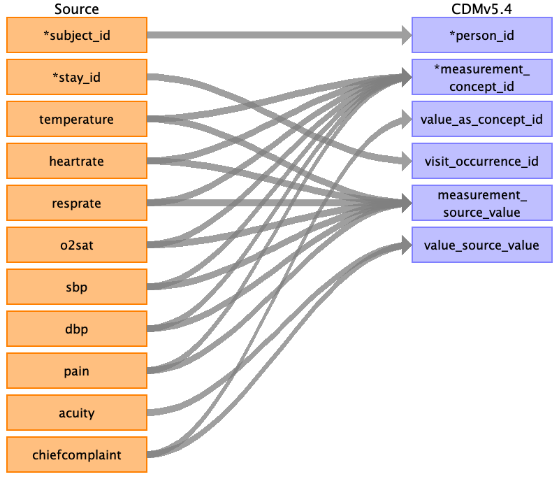

## Table name: measurement

### Reading from triage.csv

| Destination Field | Source field | Logic | Comment field |
| --- | --- | --- | --- |
| measurement_id |  |  |  |
| person_id | subject_id |  |  |
| measurement_concept_id | temperature heartrate resprate o2sat sbp dbp pain | measurement_concept_id = 4302666    Name = Body temperature  Vocab = SNOMED measurement_concept_id = 4239408    Name = Heart rate  Vocab = SNOMED measurement_concept_id = 4313591    Name = Respiratory rate  Vocab = SNOMED measurement_concept_id = 40483579    Name = Arterial oxygen saturation  Vocab = SNOMED measurement_concept_id = 4152194    Name = Systolic blood pressure  Vocab = SNOMED measurement_concept_id = 4154790    Name = Diastolic blood pressure  Vocab = SNOMED measurement_concept_id = 4022240    Name = Pain score  Vocab = SNOMED |  |
| measurement_date |  |  |  |
| measurement_datetime |  |  |  |
| measurement_time |  |  |  |
| measurement_type_concept_id |  |  |  |
| operator_concept_id |  |  |  |
| value_as_number |  |  |  |
| value_as_concept_id | chiefcomplaint |  |  |
| unit_concept_id |  |  |  |
| range_low |  |  |  |
| range_high |  |  |  |
| provider_id |  |  |  |
| visit_occurrence_id | stay_id |  |  |
| visit_detail_id |  |  |  |
| measurement_source_value | temperature heartrate resprate o2sat sbp dbp pain |  |  |
| measurement_source_concept_id |  |  |  |
| unit_source_value |  |  |  |
| unit_source_concept_id |  |  |  |
| value_source_value | chiefcomplaint acuity |  |  |
| measurement_event_id |  |  |  |
| meas_event_field_concept_id |  |  |  |

### Reading from vitalsign.csv

| Destination Field | Source field | Logic | Comment field |
| --- | --- | --- | --- |
| measurement_id |  |  |  |
| person_id | subject_id |  |  |
| measurement_concept_id | temperature heartrate resprate o2sat sbp dbp pain rhythm | measurement_concept_id = 4302666    Name = Body temperature  Vocab = SNOMED measurement_concept_id = 4239408    Name = Heart rate  Vocab = SNOMED measurement_concept_id = 4313591    Name = Respiratory rate  Vocab = SNOMED measurement_concept_id = 40483579    Name = Arterial oxygen saturation  Vocab = SNOMED measurement_concept_id = 4152194    Name = Systolic blood pressure  Vocab = SNOMED measurement_concept_id = 4154790    Name = Diastolic blood pressure  Vocab = SNOMED measurement_concept_id = 4022240    Name = Pain score  Vocab = SNOMED measurement_concept_id = 4239411    Name = Pulse rhythm  Vocab = SNOMED |  |
| measurement_date | charttime |  |  |
| measurement_datetime | charttime |  |  |
| measurement_time |  |  |  |
| measurement_type_concept_id |  |  |  |
| operator_concept_id |  |  |  |
| value_as_number |  |  |  |
| value_as_concept_id |  |  |  |
| unit_concept_id |  |  |  |
| range_low |  |  |  |
| range_high |  |  |  |
| provider_id |  |  |  |
| visit_occurrence_id | stay_id |  |  |
| visit_detail_id |  |  |  |
| measurement_source_value | temperature heartrate resprate o2sat sbp dbp rhythm pain |  |  |
| measurement_source_concept_id |  |  |  |
| unit_source_value |  |  |  |
| unit_source_concept_id |  |  |  |
| value_source_value |  |  |  |
| measurement_event_id |  |  |  |
| meas_event_field_concept_id |  |  |  |

