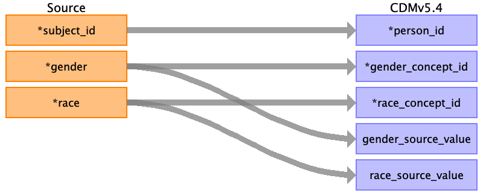

## Table name: person

### Reading from edstays.csv

| Destination Field | Source field | Logic | Comment field |
| --- | --- | --- | --- |
| person_id | subject_id |  |  |
| gender_concept_id | gender |  |  |
| year_of_birth |  |  |  |
| month_of_birth |  |  |  |
| day_of_birth |  |  |  |
| birth_datetime |  |  |  |
| race_concept_id | race |  |  |
| ethnicity_concept_id |  |  |  |
| location_id |  |  |  |
| provider_id |  |  |  |
| care_site_id |  |  |  |
| person_source_value |  |  |  |
| gender_source_value | gender |  |  |
| gender_source_concept_id |  |  |  |
| race_source_value | race |  |  |
| race_source_concept_id |  |  |  |
| ethnicity_source_value |  |  |  |
| ethnicity_source_concept_id |  |  |  |

