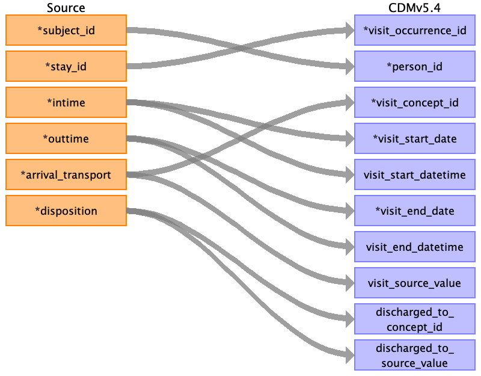
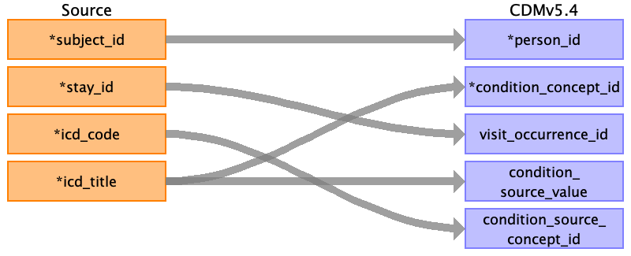

## Table name: visit_occurrence

### Reading from edstays.csv

| Destination Field | Source field | Logic | Comment field |
| --- | --- | --- | --- |
| visit_occurrence_id | stay_id |  |  |
| person_id | subject_id |  |  |
| visit_concept_id | arrival_transport |  |  |
| visit_start_date | intime |  |  |
| visit_start_datetime | intime |  |  |
| visit_end_date | outtime |  |  |
| visit_end_datetime | outtime |  |  |
| visit_type_concept_id | arrival_transport |  |  |
| provider_id |  |  |  |
| care_site_id |  |  |  |
| visit_source_value |  |  |  |
| visit_source_concept_id |  |  |  |
| admitted_from_concept_id |  |  |  |
| admitted_from_source_value |  |  |  |
| discharged_to_concept_id | disposition |  |  |
| discharged_to_source_value | disposition |  |  |
| preceding_visit_occurrence_id |  |  |  |

### Reading from triage.csv

| Destination Field | Source field | Logic | Comment field |
| --- | --- | --- | --- |
| visit_occurrence_id | stay_id |  |  |
| person_id | subject_id |  |  |
| visit_concept_id | chiefcomplaint | If the chiefcomplaint is "chest pain" and the patient was brought to the ED by ambulance, you might assign the visit_concept_id of "38004353" (Ambulance) to the visit_occurrence table. |  |
| visit_start_date |  |  |  |
| visit_start_datetime |  |  |  |
| visit_end_date |  |  |  |
| visit_end_datetime |  |  |  |
| visit_type_concept_id |  |  |  |
| provider_id |  |  |  |
| care_site_id |  |  |  |
| visit_source_value | chiefcomplaint | The chiefcomplaint field in the triage table typically contains a free-text description of the patient's reported reason for visiting the emergency department. If no matching standardized concept is found, map the chiefcomplaint to visit_source_value in the visit_occurrence table. |  |
| visit_source_concept_id |  |  |  |
| admitted_from_concept_id |  |  |  |
| admitted_from_source_value |  |  |  |
| discharged_to_concept_id |  |  |  |
| discharged_to_source_value |  |  |  |
| preceding_visit_occurrence_id |  |  |  |

