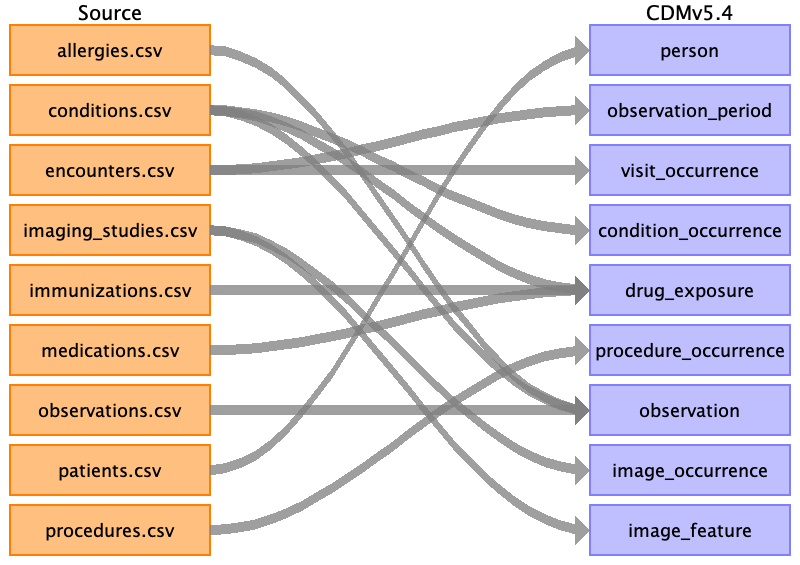

# Source Data Mapping Approach to CDMv5.4

This repository documents the mapping approach of various source data files to the OMOP Common Data Model (CDM) version 5.4. The mapping process converts healthcare data from source files into standardized tables in the CDMv5.4 format, enabling consistent data representation for clinical research and analytics.

## Overview of Mapping
The mapping from source data to CDMv5.4 is illustrated below:

## Source Data Files
The following source data files are mapped to the corresponding CDMv5.4 tables:

- allergies.csv
- conditions.csv
- encounters.csv
- imaging_studies.csv
- immunizations.csv
- medications.csv
- observations.csv
- patients.csv
- procedures.csv

## CDMv5.4 Tables
These source files are mapped to the following CDMv5.4 tables:

- person
- observation_period
- visit_occurrence
- condition_occurrence
- drug_exposure
- procedure_occurrence
- observation
- image_occurrence
- image_feature

## Table Mapping Details

Below is a detailed explanation of how each source data file is mapped to the relevant CDMv5.4 tables:

1. **[person](./i_cdm_omop_v5.4_mappings/person.md)**  
   **Source files:** patients.csv  
   **CDMv5.4 table:** person  
   **Description:** Maps demographic details from the source `patients.csv` to the `person` table in CDMv5.4, capturing data like patient IDs, gender, birth year, and other demographic attributes.

2. **[observation_period](./i_cdm_omop_v5.4_mappings/observation_period.md)**  
   **Source files:** encounters.csv  
   **CDMv5.4 table:** observation_period  
   **Description:** The period during which the patient was under observation or had healthcare encounters is mapped from `encounters.csv` to the `observation_period` table.

3. **[visit_occurrence](./i_cdm_omop_v5.4_mappings/visit_occurrence.md)**  
   **Source files:** encounters.csv  
   **CDMv5.4 table:** visit_occurrence  
   **Description:** Maps encounter details from the source to the `visit_occurrence` table, recording healthcare visits, admissions, and discharges.

4. **[condition_occurrence](./i_cdm_omop_v5.4_mappings/condition_occurrence.md)**  
   **Source files:** conditions.csv  
   **CDMv5.4 table:** condition_occurrence  
   **Description:** Diagnosed conditions or medical events are mapped from `conditions.csv` to the `condition_occurrence` table, recording diagnosis codes and related data.

5. **[drug_exposure](./i_cdm_omop_v5.4_mappings/drug_exposure.md)**  
   **Source files:** medications.csv  
   **CDMv5.4 table:** drug_exposure  
   **Description:** Maps drug prescriptions or administrations from `medications.csv` to the `drug_exposure` table, detailing drug names, dosages, and exposure periods.

6. **[procedure_occurrence](./i_cdm_omop_v5.4_mappings/procedure_occurrence.md)**  
   **Source files:** procedures.csv  
   **CDMv5.4 table:** procedure_occurrence  
   **Description:** Medical procedures performed on patients are mapped from `procedures.csv` to the `procedure_occurrence` table.

7. **[observation](./i_cdm_omop_v5.4_mappings/observation.md)**  
   **Source files:** observations.csv  
   **CDMv5.4 table:** observation  
   **Description:** Clinical observations, including vital signs or laboratory results, are captured in the `observation` table, sourced from `observations.csv`.

8. **[image_occurrence](./i_cdm_omop_v5.4_mappings/image_occurrence.md)**  
   **Source files:** imaging_studies.csv  
   **CDMv5.4 table:** image_occurrence  
   **Description:** Imaging study data is mapped from `imaging_studies.csv` to the `image_occurrence` table, detailing medical imaging procedures and results.

9. **[image_feature](./i_cdm_omop_v5.4_mappings/image_feature.md)**  
   **Source files:** imaging_studies.csv  
   **CDMv5.4 table:** image_feature  
   **Description:** Image-derived features, such as biomarker information from medical imaging, are recorded in the `image_feature` table.
