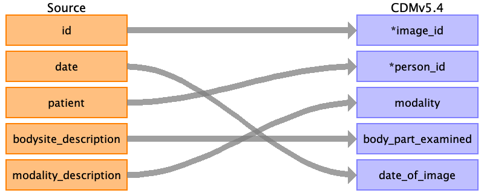

## Table name: image_occurrence

### Reading from imaging_studies.csv

| Destination Field | Source field | Logic | Comment field |
| --- | --- | --- | --- |
| image_id | id |  |  |
| person_id | patient |  |  |
| study_id |  |  |  |
| modality | modality_description |  |  |
| body_part_examined | bodysite_description |  |  |
| date_of_image | date |  |  |
| file_location |  |  |  |

