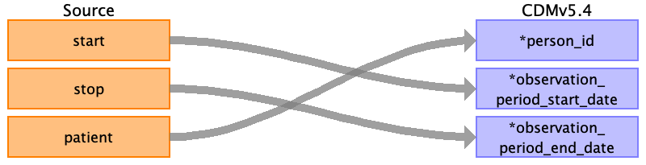

## Table name: observation_period

### Reading from encounters.csv

| Destination Field | Source field | Logic | Comment field |
| --- | --- | --- | --- |
| observation_period_id |  |  |  |
| person_id | patient | Map by mapping person.person_source_value to patient.  Find person.person_id by mapping encouters.patient to person.person_source_value. |  |
| observation_period_start_date | start | min(start) group by patient  Take the earliest START per patient |  |
| observation_period_end_date | stop | max(stop) group by patient  Take the latest STOP per patient |  |
| period_type_concept_id |  |  |  |

