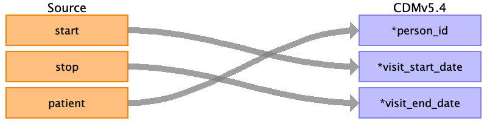

## Table name: visit_occurrence

### Reading from encounters.csv

Use logic found here:
https://github.com/OHDSI/ETL-Synthea/blob/master/ETL/SQL/AllVisitTable.sql

PART 1 - Generate visits by:
-For claim type = ‘Inpatient’ (IP):
---Sort data in ascending order by PERSON_ID, VISIT_START_DATE, VISIT_END_DATE.
---Then by PERSON_ID, collapse lines of claim as long as the time between the VISIT_END_DATE of one line and the VISIT_START_DATE of the next is <=1.
---Then each consolidated inpatient claim is considered as one inpatient visit, set 
------MIN(VISIT_START_DATE) as VISIT_START_DATE
------MAX(VISIT_END_DATE) as VISIT_END_DATE
------‘IP’ as PLACE_OF_SERVICE_SOURCE_VALUE
---See if any ‘outpatient’ (OP) or ‘emergency’ (ER) or 'urgent' (ER) records occur during an ‘inpatient’ visit.  These should be consolidated into that ‘inpatient’ visit, unless it is an ‘emergency’ or 'urgent' visit that starts and ends on the first day of the ‘inpatient’ visit.  Types of outpatient (OP) visits not collapsed: [1] if an OP starts before an IP but ends during an IP or [2] if an OP starts before and ends after an IP visit.  If an OP is collapsed into an IP and its VISIT_END_DATE is greater than the IP's VISIT_END_DATE it does not change the IP VISIT_END_DATE.

-For claim type in ('emergency','urgent') (ER)
---Sort data in ascending order by PERSON_ID, VISIT_START_DATE, VISIT_END_DATE.
---Then by PERSON_ID, collapse all (ER) claims that start on the same day as one ER visit, then take VISIT_START_DATE as VISIT_START_DATE, MAX (VISIT_END_DATE) as VISIT_END_DATE, and ‘ER’ as PLACE_OF_SERVICE_SOURCE_VALUE.

-For claim type in ('ambulatory', 'wellness', 'outpatient') (OP)
---Sort data in ascending order by PERSON_ID, VISIT_START_DATE, VISIT_END_DATE.
---Then by PERSON_ID take VISIT_START_DATE as VISIT_START_DATE, MAX (VISIT_END_DATE) as VISIT_END_DATE, and ‘OP’ as PLACE_OF_SERVICE_SOURCE_VALUE.

| Destination Field | Source field | Logic | Comment field |
| --- | --- | --- | --- |
| visit_occurrence_id |  |  |  |
| person_id | patient | Map by mapping person.person_source_value to patient.  Find person.person_id by mapping encouters.patient to person.person_source_value. |  |
| visit_concept_id |  |  |  |
| visit_start_date | start |  |  |
| visit_start_datetime |  |  |  |
| visit_end_date | stop |  |  |
| visit_end_datetime |  |  |  |
| visit_type_concept_id |  |  |  |
| provider_id |  |  |  |
| care_site_id |  |  |  |
| visit_source_value |  |  |  |
| visit_source_concept_id |  |  |  |
| admitted_from_concept_id |  |  |  |
| admitted_from_source_value |  |  |  |
| discharged_to_concept_id |  |  |  |
| discharged_to_source_value |  |  |  |
| preceding_visit_occurrence_id |  |  |  |

