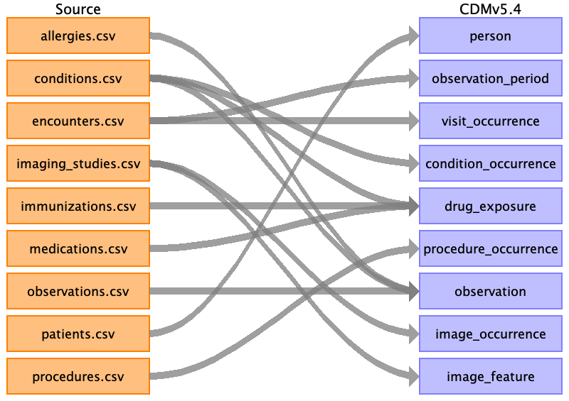

# Source Data Mapping Approach to CDMv5.4

## Contents

[person](person.md)

[observation_period](observation_period.md)

[visit_occurrence](visit_occurrence.md)

[condition_occurrence](condition_occurrence.md)

[drug_exposure](drug_exposure.md)

[procedure_occurrence](procedure_occurrence.md)

[observation](observation.md)

[image_occurrence](image_occurrence.md)

[image_feature](image_feature.md)

[source_appendix](source_appendix.md)

