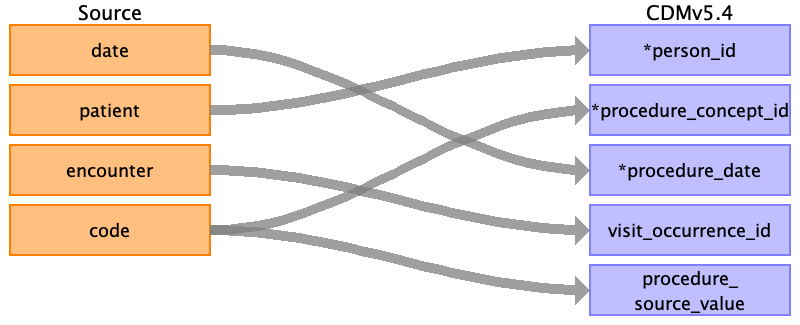

## Table name: procedure_occurrence

### Reading from procedures.csv

| Destination Field | Source field | Logic | Comment field |
| --- | --- | --- | --- |
| procedure_occurrence_id |  |  |  |
| person_id | patient | Map by mapping person.person_source_value to patient.  Find person.person_id by mapping encouters.patient to person.person_source_value. |  |
| procedure_concept_id | code | Use code to lookup target_concept_id in CTE_TARGET_VOCAB_MAP:    select ctvm.target_concept_id    from procedures pr     join cte_target_vocab_map ctvm       on ctvm.source_code              = pr.code     and ctvm.target_domain_id       = 'Procedure'     and ctvm.target_vocabulary_id = 'SNOMED' |  |
| procedure_date | date |  |  |
| procedure_datetime |  |  |  |
| procedure_end_date |  |  |  |
| procedure_end_datetime |  |  |  |
| procedure_type_concept_id |  |  |  |
| modifier_concept_id |  |  |  |
| quantity |  |  |  |
| provider_id |  |  |  |
| visit_occurrence_id | encounter | Lookup visit_occurrence_id using encounter, joining to temp table defined in AllVisitTable.sql. |  |
| visit_detail_id |  |  |  |
| procedure_source_value | code |  |  |
| procedure_source_concept_id |  |  |  |
| modifier_source_value |  |  |  |

