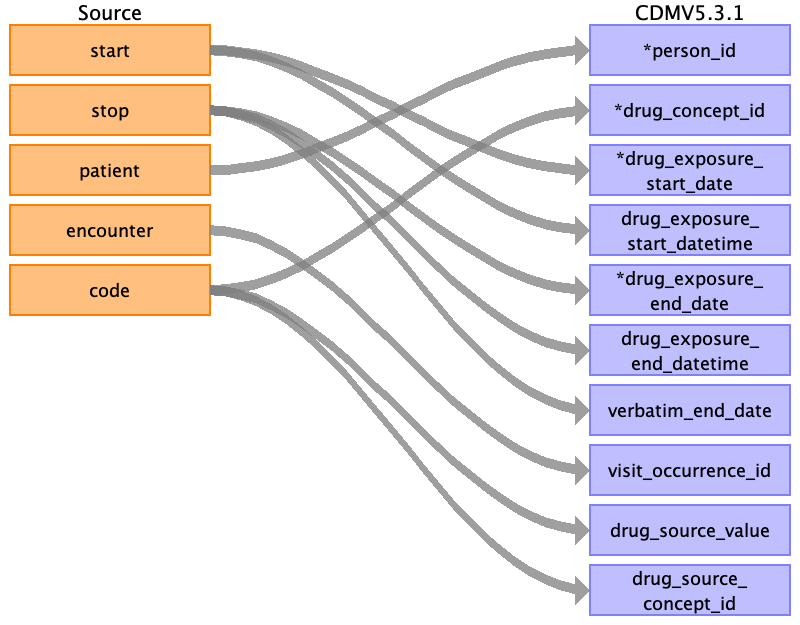
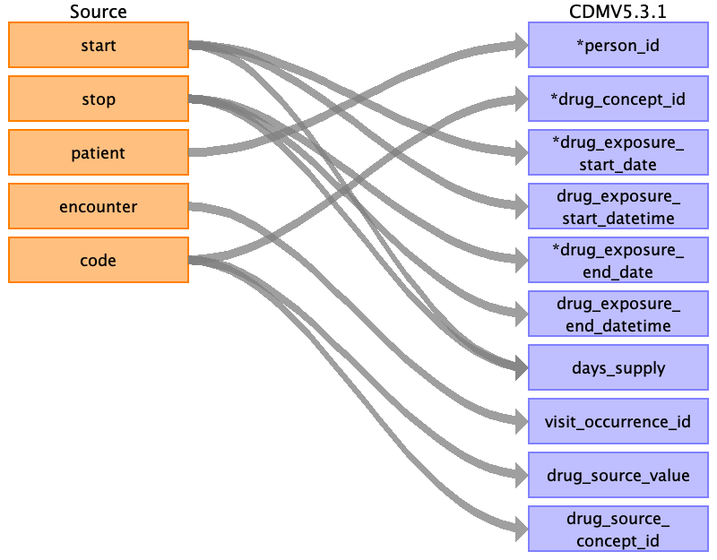
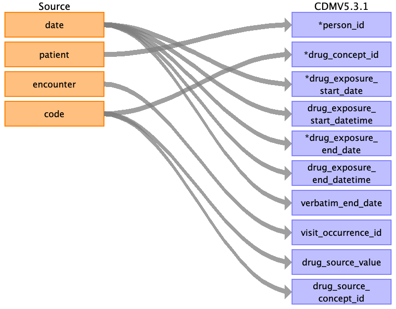

## Table name: drug_exposure

### Reading from conditions.csv

| Destination Field | Source field | Logic | Comment field |
| --- | --- | --- | --- |
| drug_exposure_id |  |  | Autogenerate |
| person_id | patient | Map by mapping person.person_source_value to patient.  Find person.person_id by mapping encouters.patient to person.person_source_value. |  |
| drug_concept_id | code | Use code to lookup target_concept_id in CTE_TARGET_VOCAB_MAP:    select ctvm.target_concept_id    from conditions c     join cte_target_vocab_map ctvm       on ctvm.source_code              = c.code     and ctvm.target_domain_id       = 'Drug'     and ctvm.target_vocabulary_id = 'RxNorm' |  |
| drug_exposure_start_date | start |  |  |
| drug_exposure_start_datetime | start |  |  |
| drug_exposure_end_date | stop |  |  |
| drug_exposure_end_datetime | stop |  |  |
| verbatim_end_date | stop |  | NULL |
| drug_type_concept_id |  |  | 581452 |
| stop_reason |  |  | NULL |
| refills |  |  | 0 |
| quantity |  |  | 0 |
| days_supply |  |  | 0 |
| sig |  |  | NULL |
| route_concept_id |  |  | 0 |
| lot_number |  |  | 0 |
| provider_id |  |  | 0 |
| visit_occurrence_id | encounter | Lookup visit_occurrence_id using encounter, joining to temp table defined in AllVisitTable.sql. |  |
| visit_detail_id |  |  | 0 |
| drug_source_value | code |  |  |
| drug_source_concept_id | code | Use code to lookup source_concept_id in CTE_SOURCE_VOCAB_MAP:     select csvm.source_concept_id     from cte_source_vocab_map csvm      join conditions c        on csvm.source_code                 = c.code      and csvm.source_vocabulary_id  = 'RxNorm' |  |
| route_source_value |  |  | NULL |
| dose_unit_source_value |  |  | NULL |

### Reading from medications.csv

| Destination Field | Source field | Logic | Comment field |
| --- | --- | --- | --- |
| drug_exposure_id |  |  | Autogenerate |
| person_id | patient | Map by mapping person.person_source_value to patient.  Find person.person_id by mapping encouters.patient to person.person_source_value. |  |
| drug_concept_id | code | Use code to lookup target_concept_id in CTE_TARGET_VOCAB_MAP:    select ctvm.target_concept_id    from medications m     join cte_target_vocab_map ctvm       on ctvm.source_code               = m.code     and ctvm.target_domain_id        = 'Drug'     and ctvm.target_vocabulary_id  = 'RxNorm' |  |
| drug_exposure_start_date | start |  |  |
| drug_exposure_start_datetime | start |  |  |
| drug_exposure_end_date | stop |  |  |
| drug_exposure_end_datetime | stop |  |  |
| verbatim_end_date |  |  | NULL |
| drug_type_concept_id |  |  | 581452 |
| stop_reason |  |  | NULL |
| refills |  |  | 0 |
| quantity |  |  | 0 |
| days_supply | start stop |  | 0 |
| sig |  |  | NULL |
| route_concept_id |  |  | 0 |
| lot_number |  |  | 0 |
| provider_id |  |  | 0 |
| visit_occurrence_id | encounter | Lookup visit_occurrence_id using encounter, joining to temp table defined in AllVisitTable.sql. |  |
| visit_detail_id |  |  | 0 |
| drug_source_value | code |  |  |
| drug_source_concept_id | code | Use code to lookup target_concept_id in CTE_SOURCE_VOCAB_MAP:    select csvm.source_concept_id    from medications m     join cte_source_vocab_map csvm      on cvm.source_code                = m.code     and cvm.source_vocabulary_id = 'RxNorm' |  |
| route_source_value |  |  | NULL |
| dose_unit_source_value |  |  | NULL |

### Reading from immunizations.csv

| Destination Field | Source field | Logic | Comment field |
| --- | --- | --- | --- |
| drug_exposure_id |  |  | Autogenerate |
| person_id | patient | Map by mapping person.person_source_value to patient.  Find person.person_id by mapping encouters.patient to person.person_source_value. |  |
| drug_concept_id | code | Use code to lookup target_concept_id in CTE_TARGET_VOCAB_MAP:    select ctvm.target_concept_id    from immunizations i     join cte_target_vocab_map ctvm       on ctvm.source_code               = i.code     and ctvm.target_domain_id        = 'Drug'     and ctvm.target_vocabulary_id = 'CVX' |  |
| drug_exposure_start_date | date |  |  |
| drug_exposure_start_datetime | date |  |  |
| drug_exposure_end_date | date |  |  |
| drug_exposure_end_datetime | date |  |  |
| verbatim_end_date | date |  | NULL |
| drug_type_concept_id |  |  | 581452 |
| stop_reason |  |  | NULL |
| refills |  |  | 0 |
| quantity |  |  | 0 |
| days_supply |  |  | 0 |
| sig |  |  | NULL |
| route_concept_id |  |  | 0 |
| lot_number |  |  | 0 |
| provider_id |  |  | 0 |
| visit_occurrence_id | encounter | Lookup visit_occurrence_id using encounter, joining to temp table defined in AllVisitTable.sql. |  |
| visit_detail_id |  |  | 0 |
| drug_source_value | code |  |  |
| drug_source_concept_id | code | Use code to lookup target_concept_id in CTE_SOURCE_VOCAB_MAP:    select csvm.source_concept_id    from immunizations i     join cte_source_vocab_map csvm      on csvm.source_code                = i.code     and csvm.source_vocabulary_id = 'CVX' |  |
| route_source_value |  |  | NULL |
| dose_unit_source_value |  |  | NULL |

