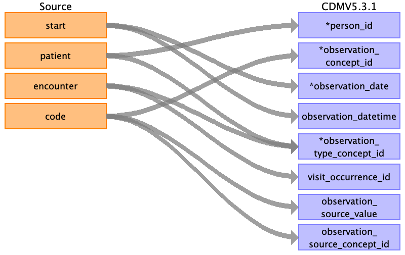

## Table name: observation

### Reading from allergies.csv

| Destination Field | Source field | Logic | Comment field |
| --- | --- | --- | --- |
| observation_id |  |  | AUTOGENERATE |
| person_id | patient | Map by mapping person.person_source_value to patient.  Find person.person_id by mapping encouters.patient to person.person_source_value. |  |
| observation_concept_id | code | Use code to lookup target_concept_id in CTE_TARGET_VOCAB_MAP:    select ctvm.target_concept_id    from allergies a     join cte_target_vocab_map ctvm       on ctvm.source_code              = a.code     and ctvm.target_domain_id       = 'Observation'     and ctvm.target_vocabulary_id = 'SNOMED' |  |
| observation_date | start |  |  |
| observation_datetime | start |  |  |
| observation_type_concept_id | encounter patient | Join to encounters to lookup encounters.description:      select case             when e.description in (  'Encounter for check up (procedure)',  'Encounter for symptom',  'Prenatal visit',  'Outpatient procedure',  'Patient encounter procedure',  'Consultation for treatment',  'Encounter for 'check-up'',  'Encounter for problem',  'Prenatal initial visit',  'Postnatal visit',  'Asthma follow-up',  'Drug addiction therapy',  'Death Certification',  'Domiciliary or rest home patient evaluation and management',  'Patient-initiated encounter',  'Allergic disorder initial assessment',  'Allergic disorder follow-up assessment',  'Drug rehabilitation and detoxification',  'Office Visit',  'Encounter Inpatient',  'Non-urgent orthopedic admission'  )            then 38000215              when e.description in (  'Emergency room admission',  'Obstetric emergency hospital admission',  'Emergency Room Admission',  'Emergency hospital admission for asthma',  'Admission to surgical department',  'Emergency Encounter',  Hospital admission',  'Admission to thoracic surgery department'  )            then 38000183    from     encounters e    join allergies a      on a.encounter = e.id    and a.patient      = e.patient Join to encounters to lookup encounters.description:      select case             when e.description in (  'Encounter for check up (procedure)',  'Encounter for symptom',  'Prenatal visit',  'Outpatient procedure',  'Patient encounter procedure',  'Consultation for treatment',  'Encounter for 'check-up'',  'Encounter for problem',  'Prenatal initial visit',  'Postnatal visit',  'Asthma follow-up',  'Drug addiction therapy',  'Death Certification',  'Domiciliary or rest home patient evaluation and management',  'Patient-initiated encounter',  'Allergic disorder initial assessment',  'Allergic disorder follow-up assessment',  'Drug rehabilitation and detoxification',  'Office Visit',  'Encounter Inpatient',  'Non-urgent orthopedic admission'  )            then 38000215              when e.description in (  'Emergency room admission',  'Obstetric emergency hospital admission',  'Emergency Room Admission',  'Emergency hospital admission for asthma',  'Admission to surgical department',  'Emergency Encounter',  Hospital admission',  'Admission to thoracic surgery department'  )            then 38000183    from     encounters e    join allergies a      on a.encounter = e.id    and a.patient      = e.patient |  |
| value_as_number |  |  | NULL |
| value_as_string |  |  | NULL |
| value_as_concept_id |  |  | 0 |
| qualifier_concept_id |  |  | 0 |
| unit_concept_id |  |  | 0 |
| provider_id |  |  | 0 |
| visit_occurrence_id | encounter | Lookup visit_occurrence_id using encounter, joining to temp table defined in AllVisitTable.sql. |  |
| visit_detail_id |  |  | 0 |
| observation_source_value | code |  |  |
| observation_source_concept_id | code | Use code to lookup source_concept_id in CTE_SOURCE_VOCAB_MAP:     select csvm.source_concept_id     from cte_source_vocab_map csvm      join allergies a        on csvm.source_code                 = a.code      and csvm.source_vocabulary_id  = 'SNOMED' |  |
| unit_source_value |  |  | NULL |
| qualifier_source_value |  |  | NULL |

### Reading from conditions.csv

| Destination Field | Source field | Logic | Comment field |
| --- | --- | --- | --- |
| observation_id |  |  | AUTOGENERATE |
| person_id | patient | Map by mapping person.person_source_value to patient.  Find person.person_id by mapping encouters.patient to person.person_source_value. |  |
| observation_concept_id | code | Use code to lookup target_concept_id in CTE_TARGET_VOCAB_MAP:    select ctvm.target_concept_id    from conditions c     join cte_target_vocab_map ctvm       on ctvm.source_code              = c.code     and ctvm.target_domain_id       = 'Observation'     and ctvm.target_vocabulary_id = 'SNOMED' |  |
| observation_date | start |  |  |
| observation_datetime | start |  |  |
| observation_type_concept_id | encounter patient | Join to encounters to lookup encounters.description:      select case             when e.description in (  'Encounter for check up (procedure)',  'Encounter for symptom',  'Prenatal visit',  'Outpatient procedure',  'Patient encounter procedure',  'Consultation for treatment',  'Encounter for 'check-up'',  'Encounter for problem',  'Prenatal initial visit',  'Postnatal visit',  'Asthma follow-up',  'Drug addiction therapy',  'Death Certification',  'Domiciliary or rest home patient evaluation and management',  'Patient-initiated encounter',  'Allergic disorder initial assessment',  'Allergic disorder follow-up assessment',  'Drug rehabilitation and detoxification',  'Office Visit',  'Encounter Inpatient',  'Non-urgent orthopedic admission'  )            then 38000215              when e.description in (  'Emergency room admission',  'Obstetric emergency hospital admission',  'Emergency Room Admission',  'Emergency hospital admission for asthma',  'Admission to surgical department',  'Emergency Encounter',  Hospital admission',  'Admission to thoracic surgery department'  )            then 38000183    from     encounters e    join condition c      on c.encounter = e.id    and c.patient      = e.patient Join to encounters to lookup encounters.description:      select case             when e.description in (  'Encounter for check up (procedure)',  'Encounter for symptom',  'Prenatal visit',  'Outpatient procedure',  'Patient encounter procedure',  'Consultation for treatment',  'Encounter for 'check-up'',  'Encounter for problem',  'Prenatal initial visit',  'Postnatal visit',  'Asthma follow-up',  'Drug addiction therapy',  'Death Certification',  'Domiciliary or rest home patient evaluation and management',  'Patient-initiated encounter',  'Allergic disorder initial assessment',  'Allergic disorder follow-up assessment',  'Drug rehabilitation and detoxification',  'Office Visit',  'Encounter Inpatient',  'Non-urgent orthopedic admission'  )            then 38000215              when e.description in (  'Emergency room admission',  'Obstetric emergency hospital admission',  'Emergency Room Admission',  'Emergency hospital admission for asthma',  'Admission to surgical department',  'Emergency Encounter',  Hospital admission',  'Admission to thoracic surgery department'  )            then 38000183    from     encounters e    join condition c      on c.encounter = e.id    and c.patient      = e.patient |  |
| value_as_number |  |  | NULL |
| value_as_string |  |  | NULL |
| value_as_concept_id |  |  | 0 |
| qualifier_concept_id |  |  | 0 |
| unit_concept_id |  |  | 0 |
| provider_id |  |  | 0 |
| visit_occurrence_id | encounter | Lookup visit_occurrence_id using encounter, joining to temp table defined in AllVisitTable.sql. |  |
| visit_detail_id |  |  | 0 |
| observation_source_value | code |  |  |
| observation_source_concept_id | code | Use code to lookup source_concept_id in CTE_SOURCE_VOCAB_MAP:     select csvm.source_concept_id     from cte_source_vocab_map csvm      join conditions c        on csvm.source_code                 = c.code      and csvm.source_vocabulary_id  = 'SNOMED' |  |
| unit_source_value |  |  | NULL |
| qualifier_source_value |  |  | NULL |

