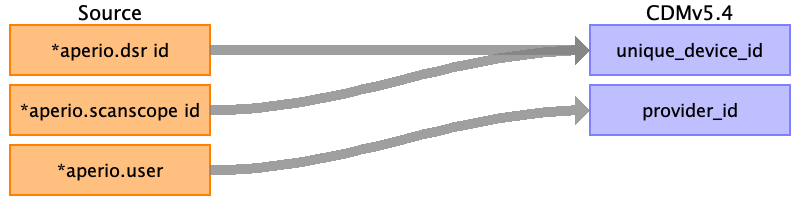

## Table name: device_exposure

### Reading from svs_metadata.csv

| Destination Field | Source field | Logic | Comment field |
| --- | --- | --- | --- |
| device_exposure_id |  |  |  |
| person_id |  |  |  |
| device_concept_id |  |  |  |
| device_exposure_start_date |  |  |  |
| device_exposure_start_datetime |  |  |  |
| device_exposure_end_date |  |  |  |
| device_exposure_end_datetime |  |  |  |
| device_type_concept_id |  |  |  |
| unique_device_id | aperio.dsr id aperio.scanscope id |  | Scanner details could also map to device_exposure for more detailed implementations. Could be used to represent the scanning device used to capture the image. |
| production_id |  |  |  |
| quantity |  |  |  |
| provider_id | aperio.user |  | Connects the device user to the specific provider involved in capturing the image.  |
| visit_occurrence_id |  |  |  |
| visit_detail_id |  |  |  |
| device_source_value |  |  |  |
| device_source_concept_id |  |  |  |
| unit_concept_id |  |  |  |
| unit_source_value |  |  |  |
| unit_source_concept_id |  |  |  |

