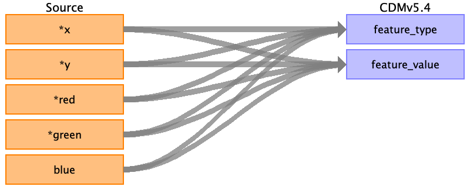
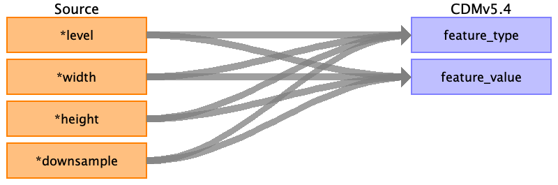
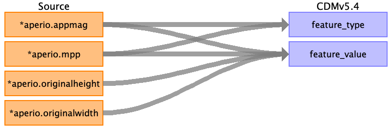

## Table name: image_feature

### Reading from svs_thumbnail.csv

| Destination Field | Source field | Logic | Comment field |
| --- | --- | --- | --- |
| feature_id |  |  |  |
| image_id |  |  |  |
| feature_type | x y red green blue | Assign feature_type_concept_id = <concept_id_for_X_Coordinate>, where concept ID represents the X-coordinate feature type. Example: 1234567. Assign feature_type_concept_id = <concept_id_for_Y_Coordinate>, where concept ID represents the Y-coordinate feature type. Example: 1234567. Assign feature_type_concept_id = <concept_id_for_Red_Channel_Intensity>, where concept ID represents the Red intensity feature. Example: 2345678. Assign feature_type_concept_id = <concept_id_for_Green_Channel_Intensity>, where concept ID represents the Green intensity feature. Example: 2345679. Assign feature_type_concept_id = <concept_id_for_Blue_Channel_Intensity>, where concept ID represents the Blue intensity feature. Example: 2345680. | Feature Type should represent the type of measurement or attribute you are capturing. This is for X coordinate. (X and Y represent the spatial position of a pixel.) Feature Type should represent the type of measurement or attribute you are capturing. This is for Y coordinate. (X and Y represent the spatial position of a pixel.) The feature is Red channel intensity (feature type) The feature is Green channel intensity (feature type) The feature is Blue channel intensity (feature type)  |
| feature_value | x y blue red green |  | Actual value from the source CSV (e.g., the X-coordinate value itself). Actual value from the source CSV (e.g., the Y-coordinate value itself). The actual value for the Blue channel intensity The actual value for the Red channel intensity The actual value for the Green channel intensity  |
| unit_concept_id |  |  |  |
| extraction_method |  |  |  |
| date_of_extraction |  |  |  |

### Reading from svs_image_data.csv

| Destination Field | Source field | Logic | Comment field |
| --- | --- | --- | --- |
| feature_id |  |  |  |
| image_id |  |  |  |
| feature_type | level width height downsample | Assign feature_type_concept_id = <concept_id_for_level>, where concept ID represents the level feature type. Example: 1234567. Assign feature_type_concept_id = <concept_id_for_width>, where concept ID represents the width feature type. Example: 1234567. Assign feature_type_concept_id = <concept_id_for_width>, where concept ID represents the width feature type. Example: 1234567. Assign feature_type_concept_id = <concept_id_for_downsample>, where concept ID represents the downsample feature type. Example: 1234567. | Level of the image pyramid (used for multi-resolution images). Width of the original image (or downsampled image level). Height of the original image (or downsampled image level). Represents how much the image has been downsampled at each level.  |
| feature_value | downsample height width level |  | The actual downsample value for the image The actual height value of the image The actual width value of the image The actual level value of the image  |
| unit_concept_id |  |  |  |
| extraction_method |  |  |  |
| date_of_extraction |  |  |  |

### Reading from svs_metadata.csv

| Destination Field | Source field | Logic | Comment field |
| --- | --- | --- | --- |
| feature_id |  |  |  |
| image_id |  |  |  |
| feature_type | aperio.appmag aperio.mpp | Assign feature_type_concept_id = <concept_id_for_magnificatione>, where concept ID represents the objective magnification feature type. Example: 123456 Assign feature_type_concept_id = <concept_id_for_mpp>, where concept ID represents the microns per pixel feature. Example: 345678. | Describes the image's magnification (e.g., 20x). Concept ID could be for magnification. MPP feature gives the resolution of the image at a pixel level.  |
| feature_value | aperio.appmag aperio.mpp aperio.originalheight aperio.originalwidth |  | Actual value of the image's magnification (e.g., 20x) Actual value of resolution of the image at a pixel level. Original height of the image Original width of image  |
| unit_concept_id |  |  |  |
| extraction_method |  |  |  |
| date_of_extraction |  |  |  |

