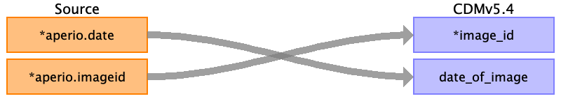

## Table name: image_occurrence

### Reading from svs_metadata.csv

| Destination Field | Source field | Logic | Comment field |
| --- | --- | --- | --- |
| image_id | aperio.imageid |  |  |
| person_id |  |  |  |
| study_id |  |  |  |
| modality |  |  |  |
| body_part_examined |  |  |  |
| date_of_image | aperio.date |  |  |
| file_location |  |  |  |

