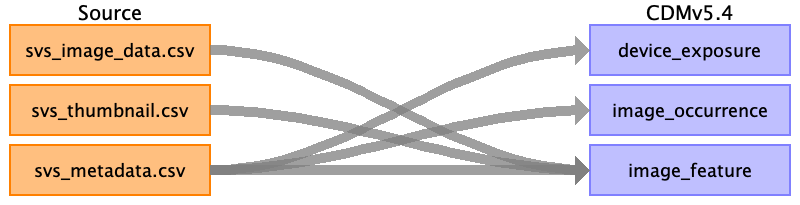

# Source Data Mapping Approach to CDMv5.4

## Contents

[device_exposure](device_exposure.md)

[image_occurrence](image_occurrence.md)

[image_feature](image_feature.md)

[source_appendix](source_appendix.md)

